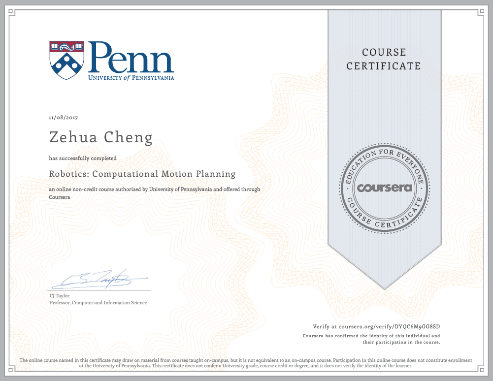

# Robotics: Computational Motion Planning

 * Assignment 1 : Implement Dijkstra's algorithm and A* algorithm;
 * Assignment 2 : Representations of configuration space of a Two Link Planar Robot;
 * Assignment 3 : Probabilistic roadmap (PRM) of configuration space of a Six Link Planar Robot;
 * Assignment 4 : Artificial Potentil Fields.

### Further information:

 * Coursera Page for [Robotics specialization](https://www.coursera.org/specializations/robotics) 
 * Coursera Page for [Computational Motion Planning](https://www.coursera.org/learn/robotics-motion-planning)  

